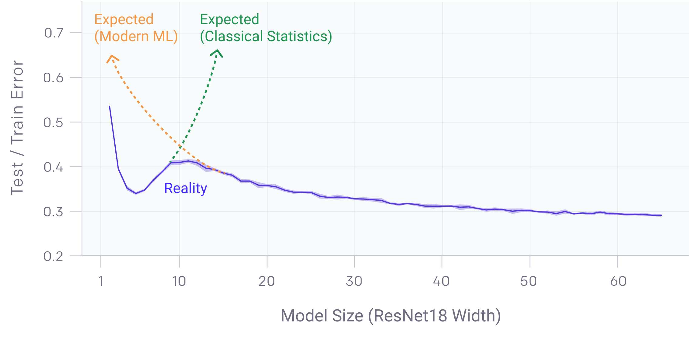

# Understanding Double Descent 
### Background
 
We focus on the phenomenon of double descent in deep learning wherein when we increase model size or 
the num-ber of epochs, performance on the test set initially improves(as expected), 
then worsens but again starts to improve andfinally saturates, which is against conventional wisdom.
This phenomenon has already been demonstrated on traditional machine 
learning models [[Belikin et.al.](https://arxiv.org/pdf/1812.11118.pdf)],
[[Belkin et.al.](https://arxiv.org/pdf/1903.07571.pdf)] but more recently was also observed in complex deep learning models 
[[Nakkiran et.al.](https://arxiv.org/pdf/1912.02292.pdf)]. 
There have also been attempts at mathematically explaining
double descent for simple linear regression settings.

### DataSets
We shall try to reproduce the limited existing results from OpenAI 
[[Nakkiran et.al.](https://arxiv.org/pdf/1912.02292.pdf)] 
which use commonly used datasets such as CIFAR-10, CIFAR-100, etc. on common 
architectures such as ResNets, VGG, etc. We shall also try to observe this 
in simple problems such as linear regression. 
More importantly, we shall try to observe its variation with different kinds and 
degrees of regularization as well as different noise levels. Existing works 
do not consider regularization in too much detail but we think it is a critical factor 
controlling the extent of double descent.
